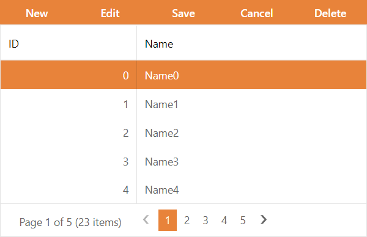

<!-- default badges list -->

<!-- default badges end -->
# Grid View for ASP.NET Web Forms - How to use external buttons to edit grid data

This example demonstrates how to use external button controls to edit a [Grid View](https://docs.devexpress.com/AspNet/5823/components/grid-view)'s data records.

## Implementation Details

The example application implements a custom toolbar populated with [ASPxButton](https://docs.devexpress.com/AspNet/DevExpress.Web.ASPxButton) controls. The [Click](https://docs.devexpress.com/AspNet/DevExpress.Web.ASPxButton.Click) event handlers of these buttons call the following methods to initiate CRUD operations:

### To create and delete rows:

- [AddNewRow](http://documentation.devexpress.com/#AspNet/DevExpressWebASPxGridViewScriptsASPxClientGridView_AddNewRowtopic)
- [DeleteRow](http://documentation.devexpress.com/#AspNet/DevExpressWebASPxGridViewScriptsASPxClientGridView_DeleteRowtopic)

### To start editing a row:

- [StartEditRow](http://documentation.devexpress.com/#AspNet/DevExpressWebASPxGridViewScriptsASPxClientGridView_StartEditRowtopic)

### To save or cancel changes:

- [UpdateEdit](http://documentation.devexpress.com/#AspNet/DevExpressWebASPxGridViewScriptsASPxClientGridView_UpdateEdittopic)
- [CancelEdit](http://documentation.devexpress.com/#AspNet/DevExpressWebASPxGridViewScriptsASPxClientGridView_CancelEdittopic)

## Files to Look At

* [Default.aspx](./CS/Solution/Default.aspx) (VB: [Default.aspx](./VB/Solution/Default.aspx))
* [Default.aspx.cs](./CS/Solution/Default.aspx.cs) (VB: [Default.aspx.vb](./VB/Solution/Default.aspx.vb))

## Documentation

- [Edit Data](https://docs.devexpress.com/AspNet/3712/components/grid-view/concepts/edit-data)

## More Examples

- [Grid View for ASP.NET Web Forms - How to edit an in-memory data set with a master-detail relationship](https://github.com/DevExpress-Examples/aspxgridview-edit-in-memory-dataset)
- [Grid View for ASP.NET Web Forms - Switch to the edit mode by clicking a status bar button or by double-clicking a row](https://github.com/DevExpress-Examples/switch-to-the-edit-mode-by-clicking-a-status-bar-button-or-by-double-clicking-a-row-e7)
- [Grid View for ASP.NET Web Forms - How to enable/disable command buttons on the client side](https://github.com/DevExpress-Examples/how-to-enable-disable-command-buttons-on-the-client-side-e2345)
<!-- feedback -->
## Does this example address your development requirements/objectives?

 

(you will be redirected to DevExpress.com to submit your response)
<!-- feedback end -->
